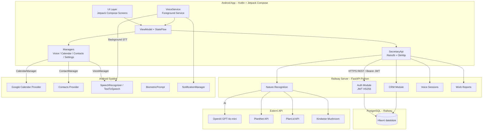
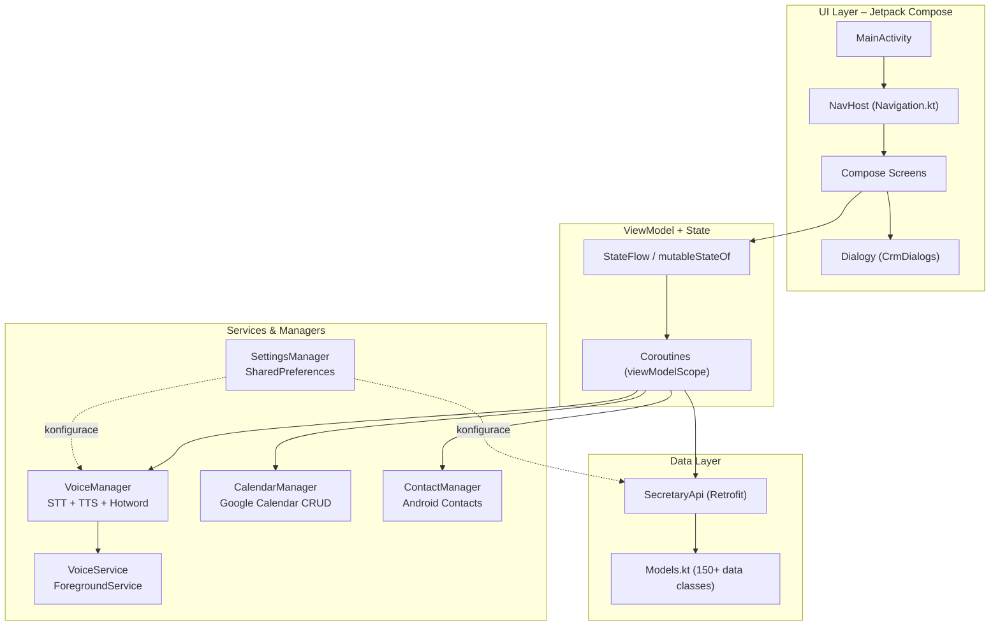
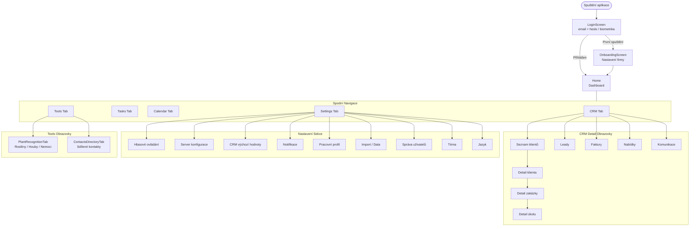
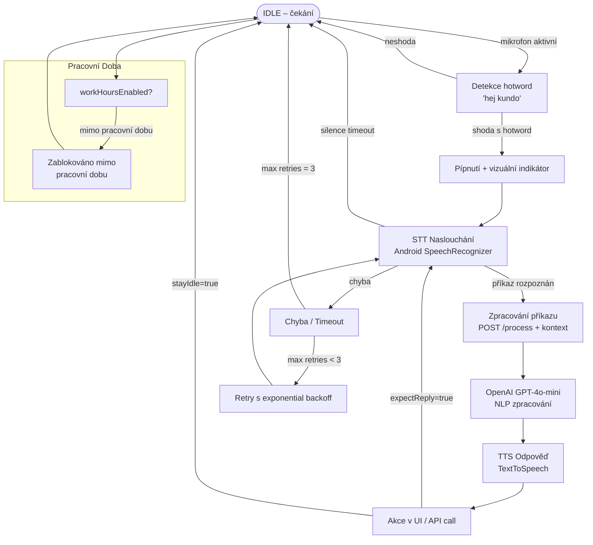
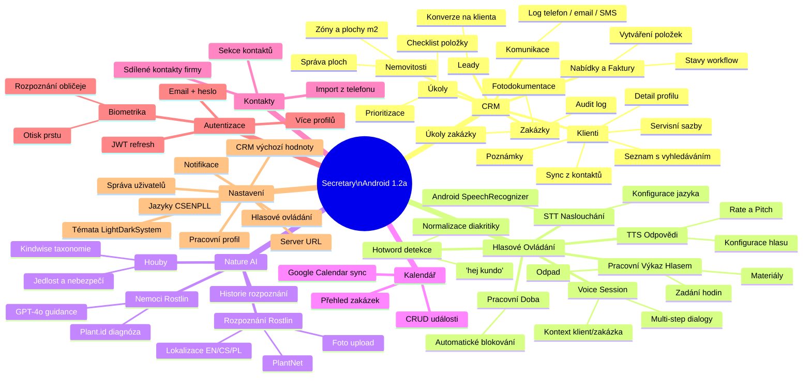
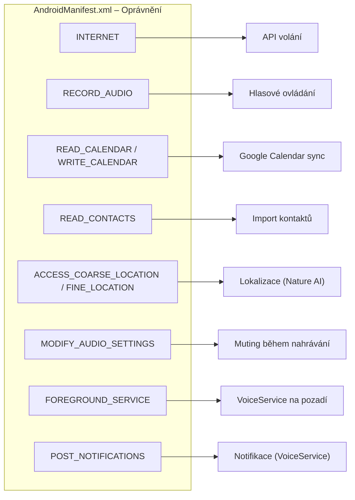

# Secretary CRM – Kompletní Mapa Systému (Android)

> Verze: 1.2a | Platform: Android 8+ (API 26+) | Stack: Kotlin + Jetpack Compose

---

## 1. Systémová Architektura

---

## 2. Architektura Aplikace (MVVM)

---

## 3. Obrazovky a Navigace

---

## 4. Voice Control Flow

---

## 5. Feature Mapa

---

## 6. Klíčové Soubory

| Soubor | Balíček | Popis |
|--------|---------|-------|
| `MainActivity.kt` | `com.example.secretary` | Hlavní aktivita, Compose host, navigace, veškerý UI stav (239 KB) |
| `Navigation.kt` | `com.example.secretary` | Sealed class – 9 obrazovek s routami, ikonami, názvy |
| `Models.kt` | `com.example.secretary` | 150+ data class pro API kontrakty |
| `SecretaryApi.kt` | `com.example.secretary` | Retrofit interface, 100+ endpointů |
| `VoiceManager.kt` | `com.example.secretary` | STT/TTS, hotword, state machine, retry logika |
| `VoiceService.kt` | `com.example.secretary` | ForegroundService pro pozadí voice listening |
| `CalendarManager.kt` | `com.example.secretary` | Google Calendar CRUD přes Calendar Provider |
| `ContactManager.kt` | `com.example.secretary` | Import kontaktů z Contacts Provider |
| `SettingsManager.kt` | `com.example.secretary` | SharedPreferences wrapper – 9 kategorií nastavení |
| `SettingsScreen.kt` | `com.example.secretary` | Compose UI pro nastavení (64 KB) |
| `LoginScreen.kt` | `com.example.secretary` | Auth obrazovka – email, heslo, biometrika |
| `OnboardingScreen.kt` | `com.example.secretary` | První spuštění – nastavení firmy |
| `CrmDialogs.kt` | `com.example.secretary` | Modální dialogy pro CRM |
| `Strings.kt` | `com.example.secretary` | Všechny UI texty CS/EN/PL (87 KB) |
| `Theme.kt` | `com.example.secretary.ui.theme` | Material3 + DesignLeaf branding |
| `VersionInfo.kt` | `com.example.secretary` | Verze a changelog |

---

## 7. Android Oprávnění

---

## 8. SettingsManager – Kategorie

| Kategorie | Klíčové vlastnosti |
|-----------|--------------------|
| **Hlas** | `hotwordEnabled`, `activationWord`, `recognitionLanguage`, `ttsRate`, `ttsPitch`, `silenceLength` |
| **Server** | `apiUrl`, `offlineMode` |
| **Auth** | `accessToken`, `refreshToken`, `currentBackendUserId`, `currentBackendUserRole` |
| **CRM** | `autoRefreshInterval`, `defaultCrmTab`, `clientSortOrder` |
| **UI** | `appLanguage`, `themeMode` |
| **Notifikace** | `persistentNotification`, `reminderMinutes` |
| **Pracovní Profil** | `workHoursEnabled`, `workHoursStart`, `workHoursEnd`, `emailSignature` |
| **Biometrika** | `BiometricProfile` list (hashed email + password) |
| **Import** | `autoImportContacts`, `cacheSize` |

---

## 9. API Integrace – Skupiny Endpointů

| Skupina | Endpointy | Použití v Androidu |
|---------|-----------|-------------------|
| `/auth/*` | login, refresh, me, change-password, users | LoginScreen, SettingsManager |
| `/crm/clients/*` | CRUD, notes, service-rates, sync-contacts | CRM Tab, Client Detail |
| `/crm/properties/*` | CRUD | Client Detail |
| `/crm/jobs/*` | CRUD, photos, notes, audit | Job Detail |
| `/crm/tasks/*` | CRUD | Tasks Tab |
| `/crm/leads/*` | CRUD, convert-to-client | CRM Tab |
| `/crm/quotes/*` | CRUD + items | CRM Tab |
| `/crm/invoices/*` | CRUD | CRM Tab |
| `/crm/communications/*` | CRUD | Client Detail |
| `/crm/contacts/*` | CRUD, import | ContactsDirectoryTab |
| `/crm/calendar-feed` | GET | Calendar Tab |
| `/work-reports/*` | CRUD + workers/entries/materials/waste | Voice Work Report |
| `/plants/*` | identify, health-assessment | PlantRecognitionTab |
| `/mushrooms/*` | identify | PlantRecognitionTab |
| `/nature/*` | history | PlantRecognitionTab |
| `/voice/*` | session start/respond/end | VoiceManager |
| `/tenant/*` | config, default-rates | SettingsScreen |
| `/health` | GET | Startup check |

---

## 10. Rychlá Reference

| Položka | Hodnota |
|---------|--------|
| App ID | `com.example.secretary` |
| Min SDK | 26 (Android 8) |
| Target SDK | 35 (Android 15) |
| Base URL | `https://web-production-4b451.up.railway.app` |
| Verze | 1.2a (Build 3) |
| Architektura | MVVM + Repository |
| UI Framework | Jetpack Compose + Material3 |
| Sítě | Retrofit2 + OkHttp3 |
| Async | Kotlin Coroutines + StateFlow |
| Auth | JWT Bearer + BiometricPrompt |
| Jazyky | CS / EN / PL |
| Témata | Systém / Světlé / Tmavé |
| Voice | Android SpeechRecognizer + TextToSpeech |
