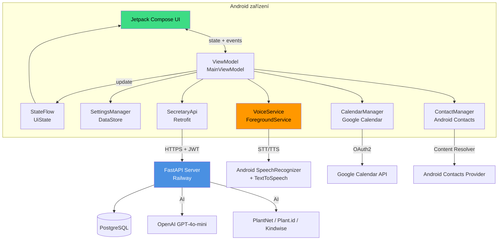
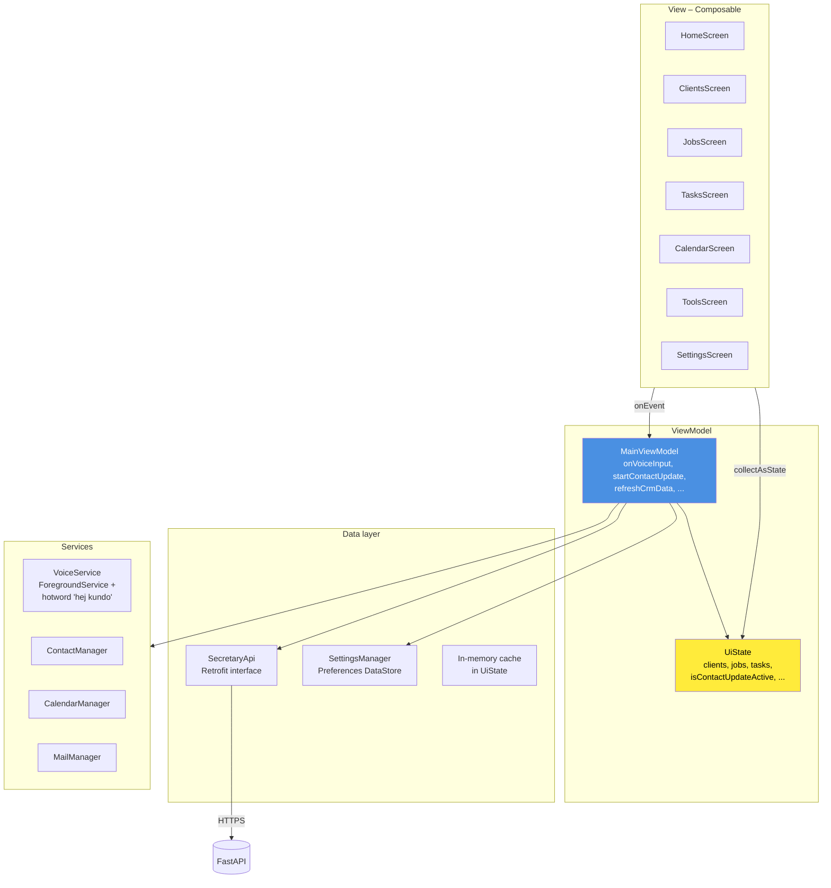
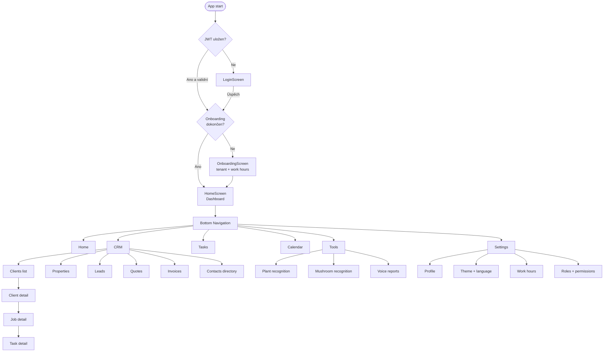
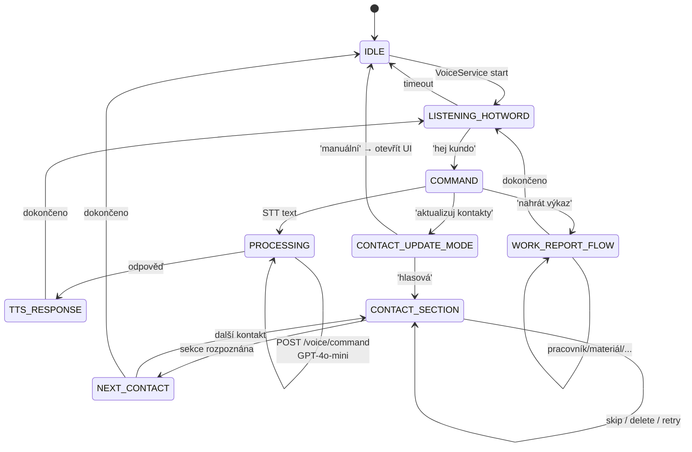
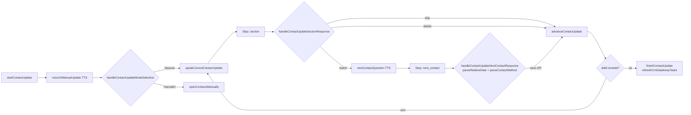
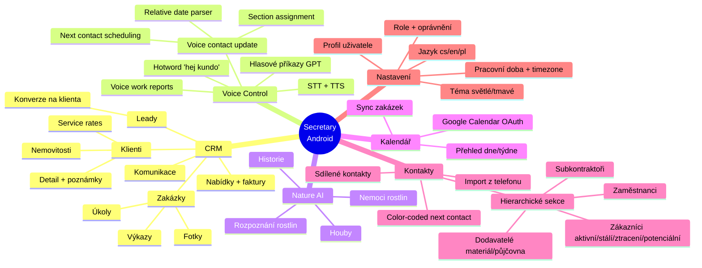
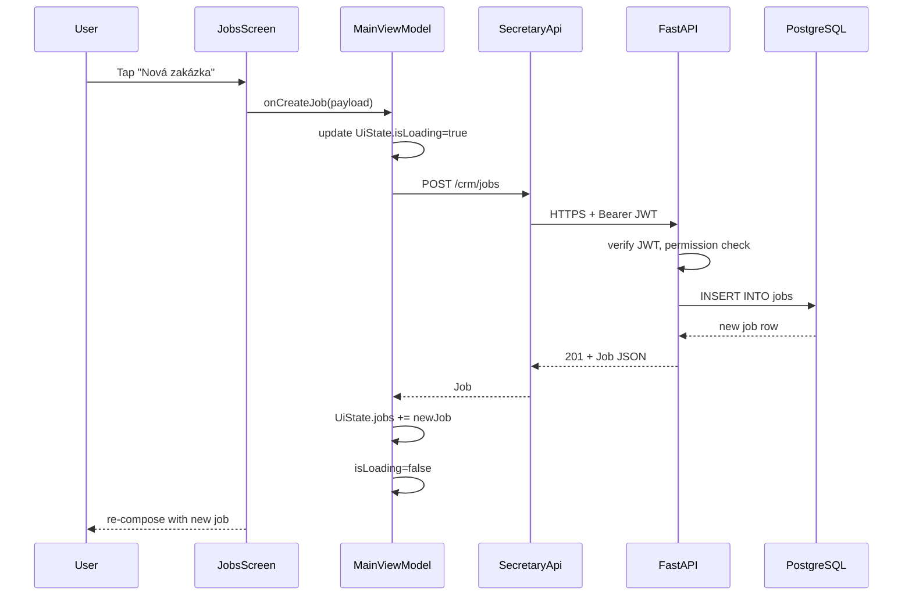
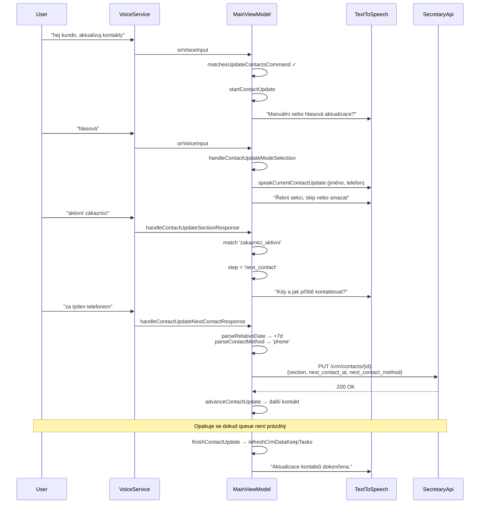

# Secretary Android – Mapa aplikace

Kotlin + Jetpack Compose klient pro Secretary CRM. Voice-control, AI rozpoznání rostlin, Google Calendar integrace, Android Contacts sync.

---

## 1. Systémová architektura

---

## 2. Architektura aplikace (MVVM)

---

## 3. Navigační flow

---

## 4. Voice control flow

### Voice contact update – 2-step state machine

---

## 5. Klíčové soubory

| Soubor | Odpovědnost |
|--------|-------------|
| `MainActivity.kt` | MainViewModel, UiState, onVoiceInput, voice state machines, CRM orchestration |
| `Models.kt` | Data classes: Client, Job, Task, SharedContact, ContactSection, ... |
| `Navigation.kt` | Compose NavHost, screen routes |
| `SecretaryApi.kt` | Retrofit interface – HTTP endpointy |
| `SettingsManager.kt` | DataStore – preferences, theme, language, work hours |
| `VoiceService.kt` | ForegroundService, hotword detection |
| `VoiceManager.kt` | STT/TTS wrapper |
| `ContactManager.kt` | Android Contacts Provider (read + write) |
| `CalendarManager.kt` | Google Calendar API OAuth + sync |
| `MailManager.kt` | SMTP odeslání přes Intent |
| `LoginScreen.kt` | Email + password → JWT |
| `OnboardingScreen.kt` | První nastavení tenantu |
| `SettingsScreen.kt` | Nastavení – profil, téma, role |
| `ContactsDirectoryTab.kt` | Seznam sdílených kontaktů, hierarchické sekce, next_contact coloring |
| `PlantRecognitionTab.kt` | Rostliny + houby – foto upload |
| `CrmDialogs.kt` | Dialogy pro CRUD operace |
| `ClientServiceRatesDialog.kt` | Individuální sazby klienta |
| `Strings.kt` | i18n (cs/en/pl), voice command matchers |

---

## 6. Feature mapa

---

## 7. Data flow – typická akce (vytvoření zakázky)

---

## 8. Voice contact update – detailní interakce

